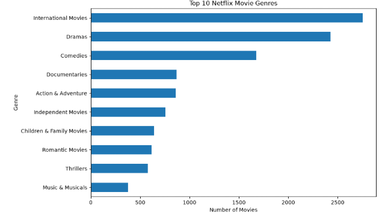
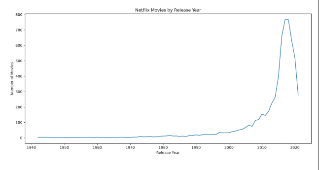
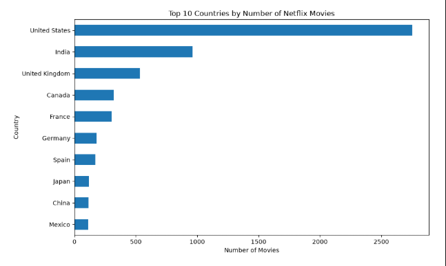

# Netflix Movies Data Analysis

## Overview

This project performs exploratory data analysis (EDA) on a Netflix movies dataset using Python and popular data analysis libraries.

The analysis focuses on identifying patterns in movie genres, ratings, countries, release years, and movie duration.

The project demonstrates practical skills in data cleaning, data manipulation, exploratory analysis, aggregation, and data visualization using Pandas, NumPy, Matplotlib, and Seaborn.

## Objectives

The main objectives of this project are:

- Identify the most common movie genres
- Identify the highest-rated movie
- Analyze movies released after 2015
- Identify countries producing the most Netflix movies
- Find the longest movie
- Analyze movie release trends by year
- Study genre frequency
- Analyze rating distributions
- Analyze movie duration
- Identify meaningful patterns in Netflix movie content

## Dataset

### Source

Kaggle — Netflix Movies and TV Shows Dataset

The dataset contains information about Netflix titles, including:

- Title
- Director
- Cast
- Country
- Date Added
- Release Year
- Rating
- Duration
- Genre/Category
- Description

The dataset was inspected and cleaned before performing the analysis.

## Technologies

- Python
- Pandas
- NumPy
- Matplotlib
- Seaborn
- Jupyter Notebook
- Git
- GitHub

## Data Cleaning

The dataset was cleaned before analysis.

The major preprocessing steps included:

- Checking the dataset shape and structure
- Identifying missing values
- Checking and removing duplicate records
- Inspecting column data types
- Converting relevant columns to appropriate data types
- Cleaning the duration column
- Handling missing values where appropriate
- Processing multi-value genre/category fields
- Processing country information for analysis
- Validating the cleaned dataset before analysis


### Genre Distribution



### Movies by Year



### Top Countries



## Key Insights

- International movies was one of the most frequently represented movie genres.
- The number of Netflix movies increased substantially during
  the later years of the dataset.
- The United States was among the countries with the largest
  number of titles.
- Movie ratings were concentrated around specific rating categories.
- Movie duration showed variation across the Netflix catalog.
- The distribution of content across countries and genres indicates
  that Netflix's movie catalog has substantial geographic and
  categorical diversity.

## Conclusion

This project demonstrates an end-to-end exploratory data analysis
workflow using a real-world Netflix dataset.

The analysis involved data inspection, cleaning, transformation,
aggregation, statistical analysis, and visualization.

The results provide insights into Netflix movie genres, ratings,
countries, release trends, and duration.

The project also demonstrates practical use of Python data analysis
libraries and Git/GitHub for documenting and managing a data
analytics project.

## How to Run

### 1. Clone the repository

```bash
git clone https://github.com/Pranavvarma18/netflix-movies-analysis.git

###2.Navigate to project

cd netflix-movies-analysis

###3.create a virtual environment

python -m venv venv

###4. Activate the virtual environment

venv\Scripts\activate

###5. Install dependencies

pip install -r requirements.txt

###6. Launch Jupyter Notebook/VS Code

###7. Open the analysis notebook

notebooks/netflix_movies_analysis.ipynb

## Project Structure

```text
netflix-movies-analysis/
│
├── data/
│   └── netflix_titles.csv
│
├── notebooks/
│   └── netflix_movies_analysis.ipynb
│
├── images/
│   ├── genre_distribution.png
│   ├── top_countries.png
│   ├── movies_by_year.png
│   ├── rating_distribution.png
│   └── duration_distribution.png
│
├── README.md
├── requirements.txt
└── .gitignore


